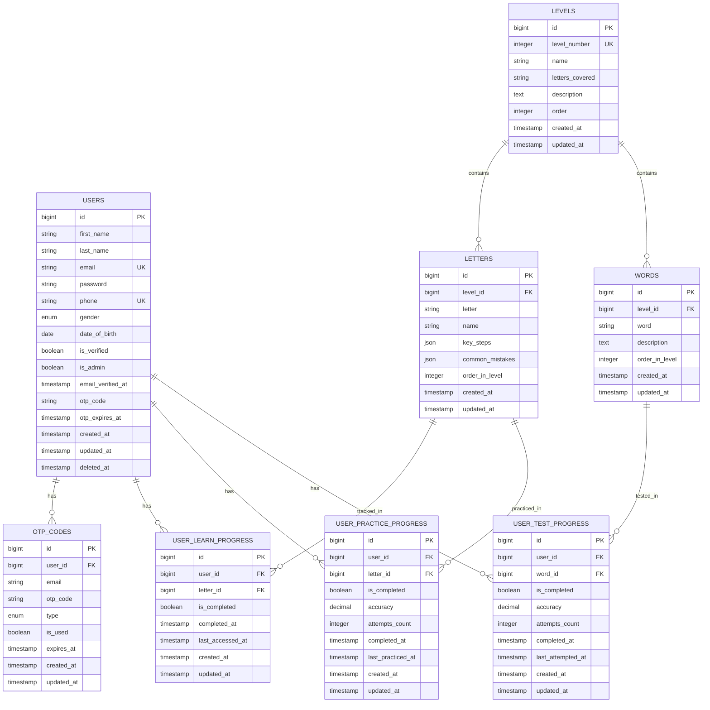

# ER Diagram - Ishara Application (Mermaid Format)

يمكنك استخدام هذا الملف لعرض ER Diagram في أي محرر يدعم Mermaid (مثل GitHub, GitLab, VS Code مع Mermaid extension).

## كيفية العرض

### في VS Code:
1. تثبيت extension: "Markdown Preview Mermaid Support"
2. فتح الملف
3. عرض Preview

### في GitHub/GitLab:
- الملف سيُعرض تلقائياً عند رفعه

### Online:
- استخدم [Mermaid Live Editor](https://mermaid.live/)

---

## Legend

- **PK** = Primary Key
- **FK** = Foreign Key
- **UK** = Unique Key
- **||--o{** = One-to-Many relationship

